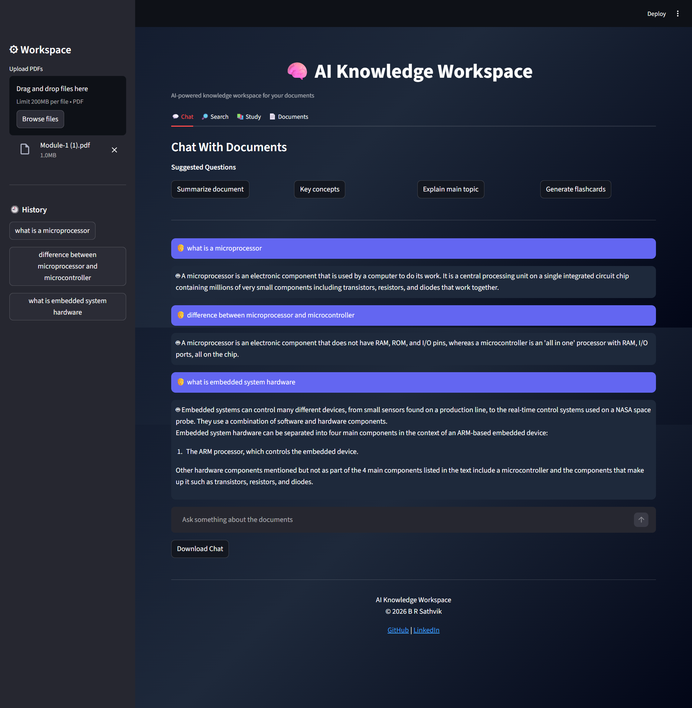
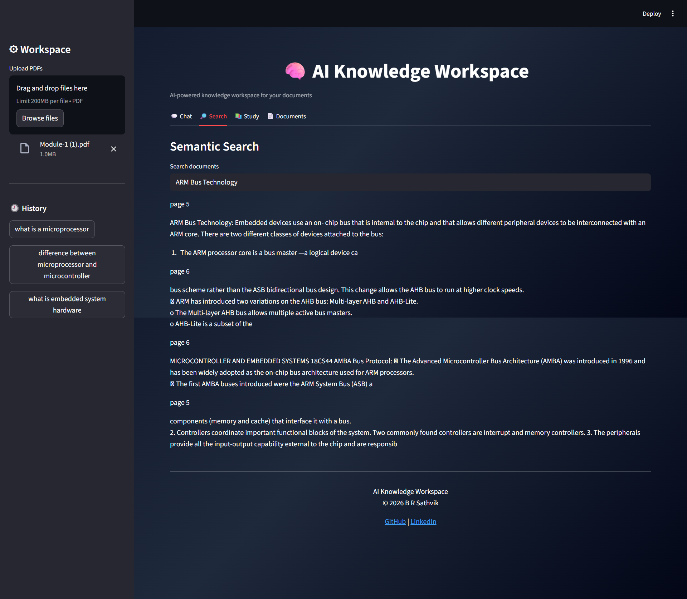
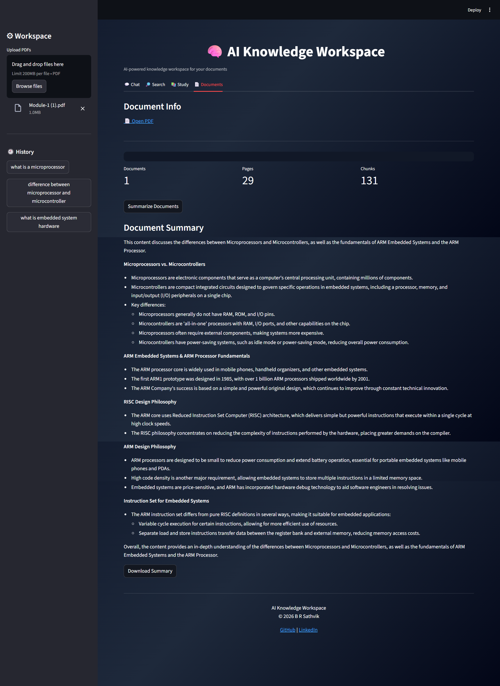

# 🧠 AI Knowledge Workspace

AI Knowledge Workspace is an AI-powered application that allows users to interact with PDF documents using natural language.

Users can upload documents, ask questions, perform semantic search, generate summaries, and create study flashcards using **Retrieval-Augmented Generation (RAG)** and **Large Language Models (LLMs)**.

---

# 🚀 Live Demo

Try the application here:

https://ai-knowledge-workspace-2nm6jeycwgdgk3u92fzvnm.streamlit.app/

---

# ✨ Features

• Chat with PDF documents using AI
• Semantic search across document content
• Document summarization
• AI-generated study flashcards
• Multi-PDF support
• Conversation history tracking
• Download AI-generated responses
• Clean SaaS-style interface

---

# 📸 Application Screenshots

## Chat Interface



---

## Semantic Search



---

## Document Summary



---

## Study Flashcards


---

# ⚙️ How It Works

1. User uploads one or more PDF documents
2. The system extracts text from the documents
3. Text is split into smaller chunks
4. Each chunk is converted into vector embeddings
5. Embeddings are stored in a FAISS vector database
6. When a question is asked, relevant chunks are retrieved
7. The AI model generates answers using the retrieved context

This method is called **Retrieval-Augmented Generation (RAG)**.

---

# 🛠 Tech Stack

Python
Streamlit
LangChain
FAISS Vector Database
HuggingFace Embeddings
Groq LLM API
Natural Language Processing (NLP)

---

# 💻 Installation

Clone the repository

```bash
git clone https://github.com/sathvik-BR/ai-knowledge-workspace.git
```

Go to the project directory

```bash
cd ai-knowledge-workspace
```

Install dependencies

```bash
pip install -r requirements.txt
```

Run the application

```bash
streamlit run app.py
```

---

# 🔑 API Key Setup

This project uses **Groq API**.

Add your API key in **Streamlit Secrets**:

```
GROQ_API_KEY="your_api_key_here"
```

---

# 👨‍💻 Author

**B R Sathvik**
Artificial Intelligence and Machine Learning Student

GitHub
https://github.com/sathvik-BR

LinkedIn
https://www.linkedin.com/in/b-r-sathvik-a9b785328

---

# 🎯 Project Purpose

This project demonstrates how modern AI systems combine:

• Large Language Models
• Vector Databases
• Retrieval-Augmented Generation
• Document-based AI assistants

to create intelligent applications that help users understand and interact with complex documents.
